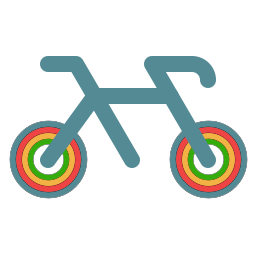

<p align="center">
  
</p>

# Pedal Map

Pedal Map is a live Citi Bike map for New York City. It makes station availability easier to scan by showing current bikes, docks, e-bikes, station capacity, and pickup/dropoff status on an interactive map.

The app also includes a station table and station detail pages powered by aggregated availability history, so stations can be compared by recent activity and typical weekday/weekend patterns.

## Data

Live station information comes from Citi Bike's public GBFS feeds:

- `station_information.json`
- `station_status.json`

Historical station summaries are read from a Convex backend via typed API references in `src/integrations/convex/api.ts`.

## Running Locally

Create a local environment file with:

```bash
VITE_MAPBOX_TOKEN=your_mapbox_token
VITE_CONVEX_URL=your_convex_url
```
